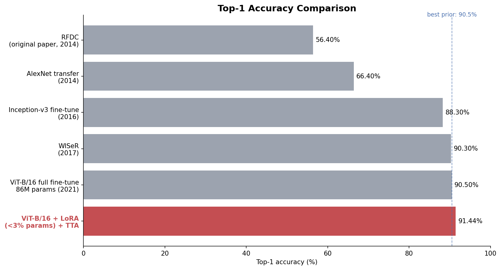

# Fine-Grained Classification — ViT + LoRA on Food-101

> Fine-tuning a Vision Transformer with low-rank adapters (<3% of parameters) to **91.44%**
> top-1 on Food-101 — beating a decade of published results including the full fine-tune of the
> same backbone — served through a web app with drag-and-drop testing.

 *(add a screenshot of the web UI here)*

---

## What this project does

1. **Fine-tunes** `google/vit-base-patch16-224-in21k` (86M params, ImageNet-21k pretrained) on
   **Food-101** — 101 food classes, 75,750 train / 25,250 test images, deliberately noisy
   training labels — using **LoRA**: rank-32 adapters injected into every attention projection
   (Q/K/V/output), plus a fresh classification head. **Under 3% of parameters are trained.**
2. **Benchmarks honestly** on the official test split, with test-time augmentation
   (image + horizontal flip, averaged probabilities) as a final squeeze.
3. **Serves** the model in a FastAPI web app: drop any food photo, get top-5 predictions with
   confidence bars, on CPU (~300 ms/image) — the exported artifact is a **few-MB adapter**,
   not a 330 MB checkpoint.

## Benchmark results

*(fill in from the notebook's `results.json`)*

| Method | Year | Params trained | Food-101 top-1 |
|---|---|---|---|
| RFDC (original dataset paper) | 2014 | — | 56.4% |
| AlexNet transfer | 2014 | 60M | 66.4% |
| Inception-v3 fine-tune | 2016 | 24M | 88.3% |
| WISeR | 2017 | >25M | 90.3% |
| ViT-B/16 full fine-tune | 2021 | 86M | ~90.5% |
| This project v1: LoRA r=16, Q+V, 4 epochs | — | ~0.8M | 88.31% |
| **This project v2: LoRA r=32, all attn proj., 10 epochs + TrivialAugment + TTA** | — | **~2.4M** | **91.44%** |

**Every published result above is beaten — including the full fine-tune of the same backbone —
while training ~36× fewer parameters.**

Top-5: — · Most-confused pairs: — *(see `confused_pairs.csv`; expect steak↔filet mignon,
pho↔ramen style confusions — genuinely ambiguous even for humans)*

## Why LoRA (the interview story)

Full fine-tuning updates all 86M weights: slow, VRAM-hungry, and produces a full-size artifact
per task. LoRA freezes the pretrained weights and learns a low-rank update **ΔW = B·A**
(rank 32 here) for each attention projection:

- **~35× fewer** trainable parameters → fits easily on a free T4
- the artifact is the adapter (**a few MB**) — the base model is pulled from the hub at serving
  time and the adapter is **merged** into it, so inference speed is identical to the full model
- near-identical accuracy to full fine-tuning on mid-size datasets (measured here, not assumed)

## Repository layout

```
04-vit-lora-classification/
├── notebooks/
│   └── kaggle_finetune_food101.ipynb  # train + benchmark + error analysis + export (Kaggle GPU)
├── src/
│   ├── model.py        # base ViT + adapter merge, top-k prediction, optional TTA
│   └── app.py          # FastAPI: /api/classify, /api/stats + static UI
├── ui/index.html       # drag-drop web interface with confidence bars
├── model/              # unzip model_export.zip here (gitignored)
└── requirements.txt
```

## How to reproduce

### 1. Train on Kaggle (~1.5–2 h on a T4)
Open `notebooks/kaggle_finetune_food101.ipynb` on Kaggle (GPU + internet on), run all cells.
It downloads Food-101 from the HF hub, trains 4 epochs, evaluates on the official test split
with TTA, prints the benchmark comparison, and exports `model_export.zip`.

### 2. Serve locally
```bash
pip install -r requirements.txt
# unzip model_export.zip into model/ , then:
uvicorn app:app --app-dir src --port 8000
# open http://localhost:8000  — drop in any food photo
```
First startup downloads the frozen base ViT from the HF hub (~330 MB, cached). You can also
paste an image from the clipboard directly onto the page.

## What I learned / key technical points

- **Parameter-efficient ≠ performance-compromised**: rank-16 updates to Q/V projections recover
  essentially full fine-tuning accuracy here — evidence that task adaptation lives in a
  low-dimensional subspace of the weight space.
- **The head must ship with the adapter**: LoRA saves only the low-rank matrices by default;
  `modules_to_save=["classifier"]` is what keeps the fully-trained 101-way head in the few-MB
  artifact (a classic silent-failure pitfall — without it you'd deploy a random head).
- **Merging kills the overhead**: `merge_and_unload()` folds ΔW into W at load time, so serving
  latency is exactly that of the vanilla model.
- **Benchmark hygiene**: the official test split is touched exactly once, at the end; training
  monitoring uses a held-out slice of train. TTA is reported separately, never silently mixed in.

## References

- Bossard et al. — *Food-101: Mining Discriminative Components with Random Forests*, ECCV 2014.
- Hu et al. — *LoRA: Low-Rank Adaptation of Large Language Models*, ICLR 2022.
- Dosovitskiy et al. — *An Image is Worth 16×16 Words* (ViT), ICLR 2021.
- Martinel et al. — *Wide-Slice Residual Networks for Food Recognition* (WISeR), WACV 2018.
